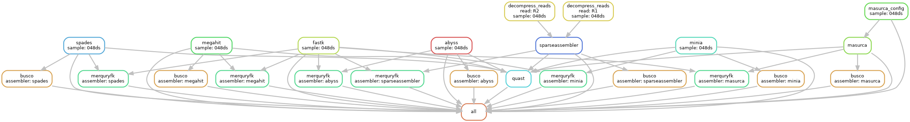

# Snakemake workflow: `FSP_assembly_benchmarking`

[](https://snakemake.github.io)
[](https://github.com/snakemake-workflows/snakemake-workflow-template/actions/workflows/main.yml)
[](https://docs.conda.io/en/latest/)
[](https://snakemake.github.io/snakemake-workflow-catalog/docs/workflows/LiaOb21/FSP_assembly_benchmarking)

A Snakemake workflow for *de novo* genome assembly using Illumina reads. 

This workflow was developed for the Fungarium Sequencing Project (FSP) at Royal Botanic Gardens, Kew. 

- [Snakemake workflow: `FSP_assembly_benchmarking`](#snakemake-workflow-name)
  - [Overview](#overview)
  - [Usage](#usage)
  - [Deployment options](#deployment-options)
  - [Authors](#authors)
  - [References](#references)
  - [TODO](#todo)

## Overview



The workflow was developed to benchmark the performance of different short reads assemblers using aDNA (ancient DNA). 

It may be useful to other projects that deal with difficult samples as the FSP, and need to find the best short reads assembler(s) for their own case.

The workflow was designed to process several samples in parallel. The flow chart above illustrates how the workflow looks like when processing a single sample (example: 048ds).

Each sample is assembled using the following assemblers:

- [SPAdes](https://github.com/ablab/spades)
- [MEGAHIT](https://github.com/voutcn/megahit)
- [AbySS](https://github.com/bcgsc/abyss)
- [SparseAssembler](https://github.com/yechengxi/SparseAssembler)
- [Minia](https://github.com/GATB/minia?tab=readme-ov-file)
- [MaSuRCA](https://github.com/alekseyzimin/masurca/tree/master)


The assemblies produced by each assembler for each sample are then quality inspected with the following tools

- [BUSCO](https://busco.ezlab.org/busco_userguide.html) - evaluates each produced assembly quality in terms of expected gene content. It is run twice for each sample, once using a general dataset, and once using a more closely related dataset. See `config/README.md` for more details.
- [QUAST](https://quast.sourceforge.net/docs/manual.html) - computes assembly statistics.
- [MerquryFK](https://github.com/thegenemyers/MERQURY.FK) - computes k-mer analysis for each assembly and compares its content with the k-mer computed for raw reads by [FastK](https://github.com/thegenemyers/FASTK).

## Usage

### Download the repo

```
git clone https://github.com/LiaOb21/FSP_assembly_benchmarking.git
```

### Prepare the required inputs

1. Your data directory structure

The directory the contains your input samples (e.g. `data`) must be structured in the following way:
```
data/
├── 048ds
│   ├── 048ds_merge.fq.gz
│   ├── 048ds_trimmed.R1.fq.gz
│   ├── 048ds_trimmed.R2.fq.gz
│   ├── 048ds_unmerged.R1.fq.gz
│   └── 048ds_unmerged.R2.fq.gz
└── 048ss
    ├── 048ss_merge.fq.gz
    ├── 048ss_trimmed.R1.fq.gz
    ├── 048ss_trimmed.R2.fq.gz
    ├── 048ss_unmerged.R1.fq.gz
    └── 048ss_unmerged.R2.fq.gz
```

In this example `048ds` and `048ss` are the only two samples present in the input directory. Note how each subdirectory is named after the sample, and the files inside each sample subdirectory have a standardised name. This is crucial for Snakemake to work properly.

2. Download BUSCO databases

### Running the workflow locally:

**Note: before running the workflow you should set up your `config.yml`. You can find it in `config/config.yml`. The `config/README.md` explains how to set up the `config.yml`.**

First install snakemake using conda:
```
conda install snakemake
conda activate snakemake
```

If you want to monitor the workflow through a console you can install the `snkmt` plugin (this is not mandatory):
```
pip install snakemake-logger-plugin-snkmt # used for monitoring resources
```

To run the workflow, you can use the following command:
```
snakemake --configfile config/config.yml --software-deployment-method conda --snakefile workflow/Snakefile --cores 8
```

If you want to use `snkmt` add this flag to the previous command: `--logger snkmt`.

### Running the workflow on the cluster

Setting up and running snakemake in gruffalo:

```
conda create -c conda-forge -c bioconda -n snakemake snakemake  #Use the full version of the commands, as otherwise an older version will be downloaded.
conda activate snakemake
pip install snakemake-executor-plugin-cluster-generic
#pip install snakemake-executor-plugin-slurm
```

Get the busco database that we will need for the QC
```
cd /home/lobinu/scratch/FSP_assembly_benchmarking

mkdir resources
cd resources

wget https://busco-data.ezlab.org/v5/data/lineages/fungi_odb12.2025-07-01.tar.gz
tar -xzf fungi_odb12.2025-07-01.tar.gz

wget https://busco-data.ezlab.org/v5/data/lineages/basidiomycota_odb12.2025-07-01.tar.gz
tar -xzf basidiomycota_odb12.2025-07-01.tar.gz

cd ..
```

To set up the config file you must at least indicate the following:
```
nano config/config.yml
---
input_dir: "/home/lobinu/test_data/clean_data/00_test" #use absolute paths and do not add `/` at the end
output_dir: "/home/lobinu/scratch/FSP_assembly_benchmarking/results"  #use absolute paths and do not add `/` at the end
busco:
  lineage1: "resources/fungi_odb12"
  lineage2: "resources/basidiomycota_odb12"
```

Run snakemake:
```
screen -S snakemake_test
conda activate snakemake
snakemake --profile profile/
```


-----

The usage of this workflow is described in the [Snakemake Workflow Catalog](https://snakemake.github.io/snakemake-workflow-catalog/docs/workflows/LiaOb21/FSP_assembly_benchmarking).

Detailed information about input data and workflow configuration can also be found in the [`config/README.md`](config/README.md).

If you use this workflow in a paper, don't forget to give credits to the authors by citing the URL of this repository or its DOI.

## Deployment options

To run the workflow from command line, change the working directory.

```bash
cd path/to/snakemake-workflow-name
```

Adjust options in the default config file `config/config.yml`.
Before running the complete workflow, you can perform a dry run using:

```bash
snakemake --dry-run
```

To run the workflow with test files using **conda**:

```bash
snakemake --cores 2 --sdm conda --directory .test
```

To run the workflow with **apptainer** / **singularity**, add a link to a container registry in the `Snakefile`, for example `container: "oras://ghcr.io/<user>/<repository>:<version>"` for Github's container registry.
Run the workflow with:

```bash
snakemake --cores 2 --sdm conda apptainer --directory .test
```

## Authors

- Firstname Lastname
  - Affiliation
  - ORCID profile
  - home page

## References

> Köster, J., Mölder, F., Jablonski, K. P., Letcher, B., Hall, M. B., Tomkins-Tinch, C. H., Sochat, V., Forster, J., Lee, S., Twardziok, S. O., Kanitz, A., Wilm, A., Holtgrewe, M., Rahmann, S., & Nahnsen, S. _Sustainable data analysis with Snakemake_. F1000Research, 10:33, 10, 33, **2021**. https://doi.org/10.12688/f1000research.29032.2.

## TODO

- Replace `<owner>` and `<repo>` everywhere in the template with the correct user name/organization, and the repository name. The workflow will be automatically added to the [snakemake workflow catalog](https://snakemake.github.io/snakemake-workflow-catalog/index.html) once it is publicly available on Github.
- Replace `<name>` with the workflow name (can be the same as `<repo>`).
- Replace `<description>` with a description of what the workflow does.
- Update the [deployment](#deployment-options), [authors](#authors) and [references](#references) sections.
- Update the `README.md` badges. Add or remove badges for `conda`/`singularity`/`apptainer` usage depending on the workflow's [deployment](#deployment-options) options.
- Do not forget to also adjust the configuration-specific `config/README.md` file.
